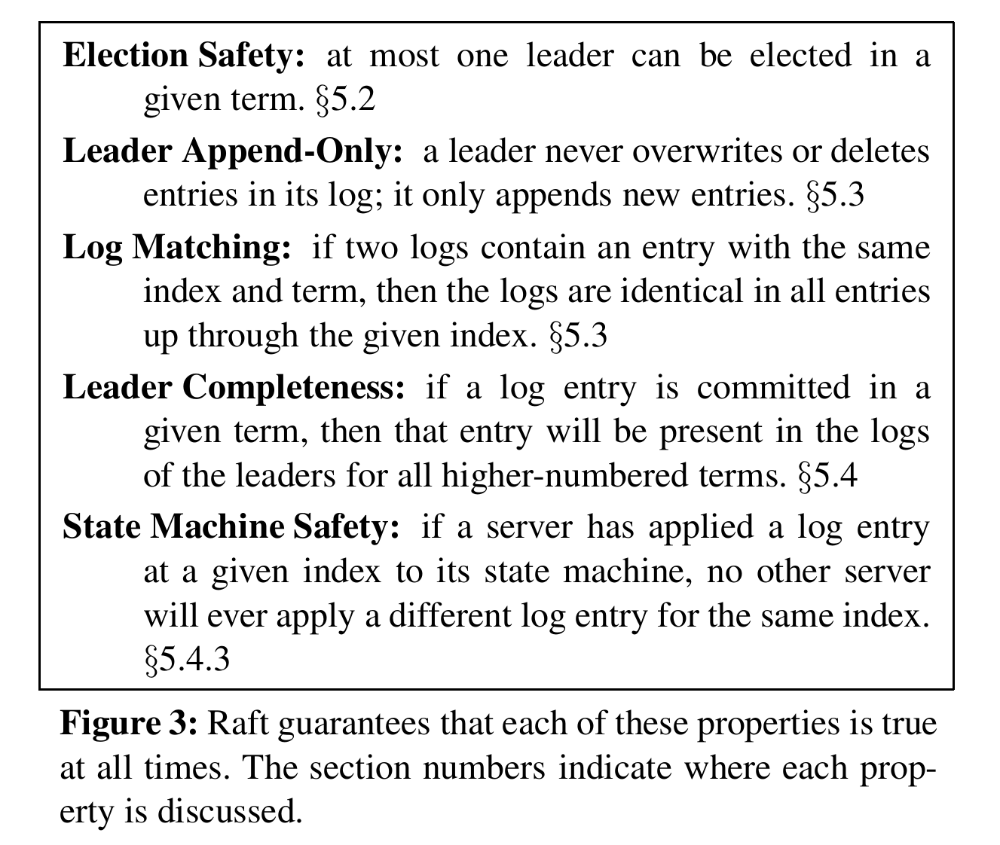

## 介绍

本项目实现了一个基于Raft算法的分布式Key-Value数据库，数据库部分采用LevelDB，部分代码参考MIT 6.5840课程的实验内容

## 使用方法

- 启动Raft节点集群（server）

```bash
# 分别运行在三个终端
go run server/server.go config/server1.yml
go run server/server.go config/server2.yml
go run server/server.go config/server3.yml
```

`server*.yml` 为配置文件，内容为集群所有节点信息以及当前节点标识，可以根据需要的集群大小修改相应的配置文件

- 建立Client使用数据库

```go
// 需要集群正在运行
clientEnds := kv.GetClientEnds(path/to/config) // 存有集群信息的配置文件
client := kv.MakeKVClient(clientEnds)

client.Put(key, value) // 向数据库中插入(key, value)
v := client.Get(key) // 查询key对应的value，返回值为value，若未查询到则为空
client.Delete(key) //删除key对应的(key, value)对
```

- 使用简易终端软件

```bash
# 需要集群正在运行
go run client/client.go config/client.yml

>> put key value # 向数据库中插入(key, value)
>> get key # 查询key对应的value
value
>> delete key # 删除key对应的(key, value)对
>> exit # 退出终端client
```

终端效果如图：


## 代码介绍

### 主要模块

- utils: 实现RPC通信的一些接口，封装了go的net库提供的RPC通信框架，以及gob编码解码器
- raft: 实现Raft算法的代码，包括选举复制等
- kv: 基于Raft算法的分布式KV数据库代码，提供Put, Get, Delete接口

### utils

- gob.go:

该文件主要为编码解码器，将数据编码为Byte数组以及从Byte数组解码出数据，该部分直接使用MIT 6.5840实验中的文件

- rpcutils.go:

其中封装了一些RPC相关的接口

```go
type ClientEnd struct {
	Addr   string
	Client *rpc.Client
}

// 对相应地址进行相应方法的RPC调用
func (e *ClientEnd) Call(methodName string, args interface{}, reply interface{}) bool

// 用于获得一个Client实例
func TryConnect(address string) *rpc.Client
```

### raft

- persister.go:

包含持久化raft状态的代码，该部分参考MIT 6.5840实验内容，将其进行改进，从原本的内存伪持久化变为了真正的落盘持久化

```go
type Persister struct {
	me        int
	mu        sync.Mutex
	raftstate []byte
}

// 用于创建一个Persister
func MakePersister(me int) *Persister

// 持久化保存RaftState
func (ps *Persister) SaveRaftState(state []byte)

// 读取持久化保存的RaftState
func (ps *Persister) ReadRaftState() []byte
```

以上的byte数组均由gob编码得到，同样通过gob解码得到RaftState的内容

- raft.go:

该文件为Raft算法的实现部分

```go
type Raft struct {
	mu        sync.Mutex    // 互斥锁，在并发过程中保持变量同步
	peers     []*utils.ClientEnd    // 服务器列表
	persister *Persister    // 上述的用于持久化Raft状态的对象
	me        int   // 当前服务器在服务器列表peers中的索引
	dead      int32 // 当前服务器是否宕机(模拟)

	// 以下三个为需要持久化的数据
	currentTerm int // 节点最后所知的Term
	votedFor    int // 当前该节点支持的候选人
	logs        []LogEntry  // 日志条目，每一个条目包含一个状态机的指令，和收到时的Term(初始化一个空条目表示start)

	commitIndex int // 已经被提交的日志条目的最大索引
	lastApplied int // 最后被应用到状态机的日志条目索引值（初始值为0）

	nextIndex []int // 每一个服务器的下一个日志条目的索引值（初始化为Leader最后索引值+1）

	identity     int    // 当前节点的身份(follower, candidate, leader)
	serversNum   int    // 服务器的总数
	heartBeatCnt int    // 心跳计数

	applyCh      chan ApplyMsg  // 用于提交命令的channel
	doAppendCh   chan int   // 用于AppendEntries的channel
	applyCmdLogs map[interface{}]*CommandState  // 用于保存命令的map
}
```

代码中包含以下方法：
```go
// 返回当前节点状态（当前Term以及当前节点是否是leader）
func (rf *Raft) GetState() (int, bool)

// 将raft状态持久化（votedFor, currentTerm, logs）
func (rf *Raft) persist()

// 从持久化的状态恢复
func (rf *Raft) readPersist(data []byte)

// 用于candidate请求其他节点进行投票
// 支持的节点超过半数，且leader的Term是最大的，同时日志的Index也是最大的
func (rf *Raft) RequestVote(args *RequestVoteArgs, reply *RequestVoteReply) error

// 为节点的log进行AppendEntries，用于HeartBeat和log replication
func (rf *Raft) AppendEntries(args *AppendEntriesArgs, reply *AppendEntriesReply) error

// 通过RPC调用目标节点的RequestVote请求目标节点的投票
func (rf *Raft) sendRequestVote(server int, args *RequestVoteArgs, reply *RequestVoteReply) bool

// 通过RPC调用目标节点的AppendEntries用于HeartBeat和log replication
func (rf *Raft) sendAppendEntries(server int, args *AppendEntriesArgs, reply *AppendEntriesReply) bool

// 让Raft节点执行命令command，返回index, term, isLeader
func (rf *Raft) Start(command interface{}) (int, int, bool)

// 向所有follower发送日志用于复制
func (rf *Raft) sendLogEntry(signal int)

// 将提交的命令应用于状态机
func (rf *Raft) apply()

// 创建一个Raft节点实例，有一个协程根据节点身份循环进行各自的操作，还有一个协程循环进行Log Replication
func MakeRaft(peers []*utils.ClientEnd, me int,
persister *Persister, applyCh chan ApplyMsg) *Raft

// 用于leader的选举
func (rf *Raft) leaderElection(wonCh chan int, wgp *sync.WaitGroup)
```

### kv

该部分为分布式kv数据库实现

- utils.go:

该文件定义了Get，Put，Delete的参数和回复内容，以及为调用方法定义了一些简单的变量

```go
const (
	OK             = "OK"
	ErrNoKey       = "ErrNoKey"
	ErrWrongLeader = "ErrWrongLeader"
	ErrLevelDB     = "ErrLevelDB"
	NoKeyValue     = ""
	RPCGet         = "KVServer.Get"
	RPCPut         = "KVServer.Put"
	RPCDelete      = "KVServer.Delete"
	RPCGetState    = "KVServer.IsLeader"
	OpPut          = "Put"
	OpGet          = "Get"
	OpDelete       = "Delete"
	CommitTimeout  = "CommitTimeout"
)
```

- client.go

该文件定义了使用kv数据库的客户端，提供相应的接口

```go
type Client struct {
servers   []*utils.ClientEnd
id        uuid.UUID
serverLen int
leader    int
}

// 创建Client实例
func MakeKVClient(servers []*utils.ClientEnd) *Client

// 对分布式数据库执行 Get(key)
func (client *Client) Get(key string) string

// 对分布式数据库执行 Put(key, value)
func (client *Client) Put(key string, value string)

// 对分布式数据库执行 Delete(key)
func (client *Client) Delete(key string)
```

- server.go

该文件定义了分布式KV数据库的节点KV Server，基于上述Raft节点

```go
type KVServer struct {
	mu      sync.Mutex
	me      int
	rf      *raft.Raft
	applyCh chan raft.ApplyMsg
	dead    int32

	leveldb       *leveldb.DB
	commonReplies []*CommonReply    // 命令执行后的回复
}
```

其中提供了分布式KV数据库的相应接口，供客户端调用

```go
// 查找数据库执行结果的回复
func (kv *KVServer) findReply(op *Op, idx int, reply *CommonReply) string

// 为客户端提供Get的RPC调用
func (kv *KVServer) Get(args *GetArgs, reply *GetReply) error

// 为客户端提供Put的RPC调用
func (kv *KVServer) Put(args *PutArgs, reply *PutReply) error

// 为客户端提供Delete的RPC调用
func (kv *KVServer) Delete(args *DeleteArgs, reply *DeleteReply) error

// 为客户端提供获取当前节点状态的RPC调用
func (kv *KVServer) IsLeader(args *StateArgs, reply *StateReply) error

// 创建一个KVServer实例，通过一个协程不断处理客户端的Get, Put, Delete请求
func StartKVServer(servers []*utils.ClientEnd, me int, persister *raft.Persister) *KVServer

// 循环从applyCh中读取已经应用到数据库的命令并执行
func (kv *KVServer) opHandler()
```

## 测试

本项目的测试主要是为了验证实现的Raft算法的功能正确性和安全性。其中，安全性测试需要验证实现的Raft满足原论文中的以下性质：



在这五条性质中，状态机安全性(State Machine Safety)是最重要的，前四条性质也可以理解成为了这一性质服务。

本项目实现的基本测试样例如下：

```go
// KV数据库基本增删改查操作
func TestBasicPutGet(t *testing.T)

// 测试特定服务器是否为Leader
func TestGetState(t *testing.T)

// 测试Leader宕机后进行下一轮选举产生新Leader的功能
func TestReElection(t *testing.T)

// 测试Follower宕机恢复后同步Leader日志的功能
func TestFollowerFailureRecovery(t *testing.T)

// 测试日志复制的正确性和一致性
func TestLogConsistency(t *testing.T)
```

其中，为了模拟特定服务器的宕机和恢复，调用了`raft.go`和`server.go`的函数：

```go
// raft.go

// 使Raft服务器掉线
func (rf *Raft) Kill() 

// 使Raft服务器恢复运行
func (rf *Raft) Restart()
```

```go
//server.go

// 使服务器掉线并关闭对应的KV数据库
func (kv *KVServer) Kill(args *KillArgs, reply *KillReply) error

// 使服务器恢复连接并重启对应的KV数据库
func (kv *KVServer) Restart(args *KillArgs, reply *KillReply) error 
```

用户也可以通过`clientEnd.Call()`方法调用相应接口主动对KV服务器进行操作。

在进行这些测试样例的过程中，五条安全性质能够分别得到验证（否则这些测试样例都无法通过）。

此外，本项目进行了`Go fuzz`测试，模拟了消息延迟、消息丢失、节点宕机等实际场景中可能出现的负面情况，以证明其在长期运行下有足够的`fault-tolerent`能力。

部分代码展示和解析：

```go
func simulateNetworkIssues() bool {
	// 10%概率消息丢失
	if (rand.Int() % 1000) < 100 {
		log.Println("drop this message")
		return false
	} else if (rand.Int() % 1000) < 200 { // 10%概率消息长延迟但不超过electionTimeOut的一半
		ms := rand.Int63() % (int64(raft.ElectionTimeout) / 2)
		log.Println("super delay")
		time.Sleep(time.Duration(ms) * time.Second)
	} else { // 80%概率延迟0~12ms
		ms := (rand.Int63() % 13)
		log.Println("normal delay")
		time.Sleep(time.Duration(ms) * time.Millisecond)
	}
	return true
}

func FuzzTest(f *testing.F) {
	// 省略部分

	// 每次随机生成种子
	rand.Seed(time.Now().UnixNano())

	f.Fuzz(func(t *testing.T, key string, value string) {
		if len(key) == 0 || len(value) == 0 {
			t.Skip("Skipping empty key or value")
		}

		if simulateNetworkIssues() {
			client.Put(key, value)
			log.Println("just put")
			got := client.Get(key)
			log.Println("just get")
			if got != value {
				t.Errorf("For key %v, expected value %v, got %v", key, value, got)
			}
		} else {
			t.Logf("Message lost: Skipping Put for key %v", key)
		}

		if rand.Intn(10) < 1 { // 10% 概率模拟节点崩溃
			node := rand.Intn(len(clientEnds))
			log.Printf("FuzzTest: Killing and restarting node %d", node)

			killReply := &KillReply{}
			clientEnds[node].Call("KVServer.Kill", &KillArgs{}, killReply)
			time.Sleep(1000 * time.Millisecond)

			restartReply := &KillReply{}
			clientEnds[node].Call("KVServer.Restart", &KillArgs{}, restartReply)
			time.Sleep(1000 * time.Millisecond)
		} else if rand.Intn(10) < 2 { // 10% 概率模拟 Leader 崩溃
			leaderIdx := FindLeader(clientEnds)
			if leaderIdx != -1 {
				leader := clientEnds[leaderIdx]

				killReply := &KillReply{}
				leader.Call("KVServer.Kill", &KillArgs{}, killReply)
				log.Printf("Leader %d killed: %v", leaderIdx, killReply.IsDead)
				time.Sleep(500 * time.Millisecond) // 等待新的 Leader 选举出来

				// 确保新的 Leader 被选举
				newLeaderIdx := FindLeader(clientEnds)
				if newLeaderIdx == -1 {
					t.Fatalf("No new leader elected after leader failure")
				}
				time.Sleep(1000 * time.Millisecond)

				restartReply := &KillReply{}
				leader.Call("KVServer.Restart", &KillArgs{}, restartReply)
				time.Sleep(1000 * time.Millisecond)
			}
		}

		time.Sleep(time.Millisecond * time.Duration(rand.Intn(100)))
	})

}

```